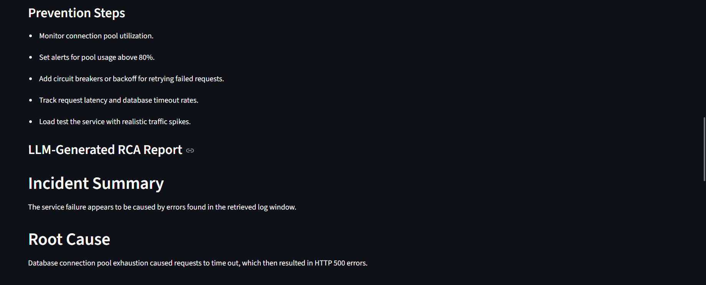
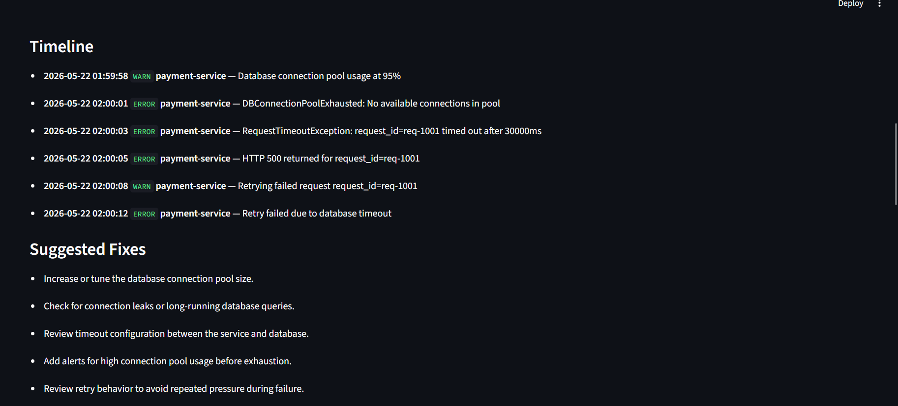
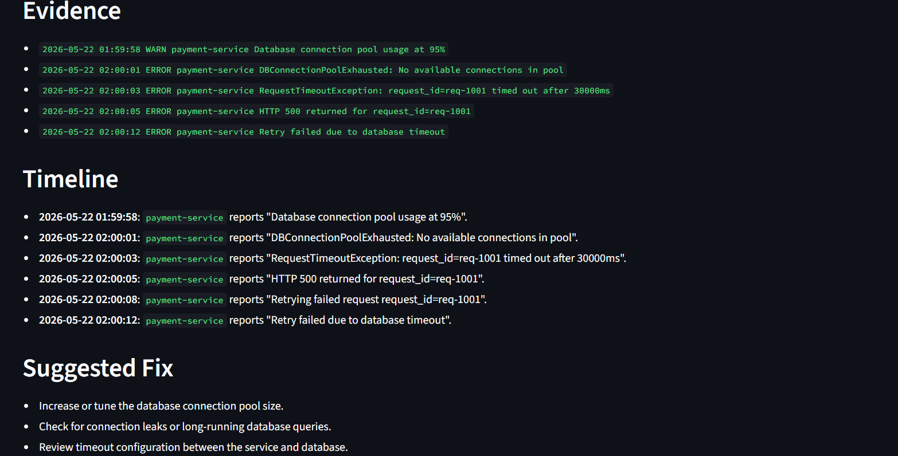

# AgentOps: Autonomous SRE Diagnostics Agent

AgentOps is a backend + AI agent tooling project that analyzes raw system logs and generates structured Root Cause Analysis (RCA) reports.

It uses a LangGraph-based workflow to parse logs, retrieve relevant evidence, detect failure patterns, optionally route to runbook context, and generate an evidence-grounded incident report.

This project demonstrates backend engineering, agentic AI workflow design, SRE-style diagnostics, explainable retrieval, and production-style API design.

---

## Why AgentOps?

During production incidents, engineers often spend significant time reading noisy logs, identifying the actual failure sequence, checking runbooks, and writing RCA reports.

AgentOps automates the first layer of this workflow.

Given a log file and a question like:

## Demo

### RCA Summary



### Incident Timeline



### Evidence-Grounded RCA



```text
Why did the service fail around 2 AM?
```

AgentOps returns:

- Incident summary
- Probable root cause
- Evidence lines from logs
- Chronological incident timeline
- Suggested fixes
- Prevention steps
- Confidence score
- LangGraph workflow trace
- Optional Gemini-generated RCA summary

---

## Features

- Upload `.log` or `.txt` files
- Parse structured log lines into timestamp, level, service, and message fields
- Build context-aware chunks around `WARN` and `ERROR` lines
- Retrieve relevant log chunks using keyword scoring, severity scoring, and time-aware scoring
- Generate explainable retrieval score breakdowns
- Detect failure patterns such as:
  - Database connection pool exhaustion
  - Request timeouts
  - HTTP 500 errors
  - Retry failures
- Generate structured RCA reports
- Extract chronological incident timelines
- Use LangGraph for agentic workflow orchestration
- Add conditional routing:
  - High confidence → generate RCA directly
  - Low confidence → search internal runbook context first
- Optional Gemini-powered RCA summary generation
- Streamlit UI for demo

---

## Architecture

```text
Streamlit Frontend
        ↓
FastAPI Backend
        ↓
LangGraph Diagnostics Workflow
        ↓
parse_and_chunk_logs
        ↓
retrieve_logs
        ↓
analyze_patterns
        ↓
decide_docs_search
        ├── high confidence → generate_report
        └── low confidence  → search_docs → generate_report
```

---

## LangGraph Workflow

AgentOps models incident diagnosis as a multi-step workflow instead of a single LLM call.

```text
START
  ↓
parse_and_chunk_logs
  ↓
retrieve_logs
  ↓
analyze_patterns
  ↓
decide_docs_search
     ↓ yes                    ↓ no
search_docs              generate_report
     ↓                         ↓
generate_report
  ↓
END
```

Each node performs one responsibility:

| Node | Responsibility |
|---|---|
| `parse_and_chunk_logs` | Parse raw logs and build context chunks |
| `retrieve_logs` | Retrieve relevant evidence using hybrid scoring |
| `analyze_patterns` | Detect known error patterns and estimate confidence |
| `decide_docs_search` | Decide whether runbook context is needed |
| `search_docs` | Select relevant internal runbook context |
| `generate_report` | Generate final RCA report |

---

## Tech Stack

### Backend

- Python
- FastAPI
- LangGraph
- Pydantic
- python-dotenv
- Gemini API optional

### Frontend

- Streamlit
- Requests

### AI / Agentic Workflow

- LangGraph workflow orchestration
- Rule-based RCA engine
- Optional Gemini RCA generation
- Conditional agent routing
- Evidence-grounded reporting

---

## Project Structure

```text
agentOps-sre-diagnostics/
  backend/
    app/
      main.py
      agent/
        graph.py
        nodes.py
        state.py
        prompts.py
      rag/
        ingest.py
        retriever.py
      schemas/
        diagnose.py
      services/
        llm.py
        web_search.py
    data/
      sample.log
      unknown_error.log
    requirements.txt
    .env.example

  frontend/
    streamlit_app.py
    requirements.txt

  README.md
  .gitignore
```

---

## Sample Input

Question:

```text
Why did the service fail around 2 AM?
```

Sample log sequence:

```log
2026-05-22 01:59:58 WARN  payment-service Database connection pool usage at 95%
2026-05-22 02:00:01 ERROR payment-service DBConnectionPoolExhausted: No available connections in pool
2026-05-22 02:00:03 ERROR payment-service RequestTimeoutException: request_id=req-1001 timed out after 30000ms
2026-05-22 02:00:05 ERROR payment-service HTTP 500 returned for request_id=req-1001
2026-05-22 02:00:12 ERROR payment-service Retry failed due to database timeout
```

---

## Sample Output

```json
{
  "probable_root_cause": "Database connection pool exhaustion caused requests to time out, which then resulted in HTTP 500 errors.",
  "detected_patterns": [
    "database_connection_pool_exhaustion",
    "timeout",
    "http_500_errors",
    "retry_failures"
  ],
  "confidence_score": 0.9,
  "workflow_trace": [
    "parse_and_chunk_logs",
    "retrieve_logs",
    "analyze_patterns",
    "decide_docs_search",
    "generate_report"
  ]
}
```

Timeline:

```text
01:59:58 - Database connection pool usage at 95%
02:00:01 - DBConnectionPoolExhausted
02:00:03 - RequestTimeoutException
02:00:05 - HTTP 500 returned
02:00:12 - Retry failed due to database timeout
```

---

## Retrieval Scoring

AgentOps uses explainable hybrid retrieval.

Each chunk receives a score from:

```text
retrieval_score = keyword_score + severity_score + time_score
```

Example:

```json
{
  "keyword_score": 2,
  "severity_score": 2,
  "time_score": 3
}
```

Why this matters:

- Logs are time-series data
- Error severity matters
- Keyword matching helps locate relevant failures
- Time-aware retrieval improves incident-specific diagnosis

---

## Running Locally

### 1. Clone the repository

```bash
git clone https://github.com/YOUR_USERNAME/agentops-sre-diagnostics.git
cd agentops-sre-diagnostics
```

Replace `YOUR_USERNAME` with your GitHub username.

### 2. Start the backend

```bash
cd backend
pip install -r requirements.txt
uvicorn app.main:app --reload
```

Backend runs at:

```text
http://127.0.0.1:8000
```

API docs:

```text
http://127.0.0.1:8000/docs
```

### 3. Start the frontend

Open a new terminal:

```bash
cd frontend
pip install -r requirements.txt
streamlit run streamlit_app.py
```

Frontend runs at:

```text
http://localhost:8501
```

---

## Environment Variables

Create a `.env` file inside `backend/` only if you want Gemini-generated RCA summaries.

```env
GEMINI_API_KEY=your_api_key_here
GEMINI_MODEL=gemini-2.0-flash
```

If no Gemini key is provided, the deterministic RCA pipeline still works.

Important:

```text
Never commit .env or API keys.
```

---

## API Endpoint

### `POST /diagnose`

Form data:

| Field | Type | Required |
|---|---|---|
| `question` | string | yes |
| `log_file` | file | yes |
| `system_type` | string | no |

Returns:

- RCA summary
- Root cause
- Evidence lines
- Timeline
- Suggested fixes
- Prevention steps
- Workflow trace
- Debug info

---

## High-Confidence vs Low-Confidence Routing

AgentOps uses conditional routing inside LangGraph.

### High-confidence path

```text
parse_and_chunk_logs
  ↓
retrieve_logs
  ↓
analyze_patterns
  ↓
decide_docs_search
  ↓
generate_report
```

### Low-confidence path

```text
parse_and_chunk_logs
  ↓
retrieve_logs
  ↓
analyze_patterns
  ↓
decide_docs_search
  ↓
search_docs
  ↓
generate_report
```

If the analyzer cannot confidently detect the failure pattern, the agent routes to `search_docs` and adds runbook context before generating the RCA.

---

## Current Runbook Context

The current implementation uses rule-based internal runbook selection for:

- Authentication/token validation issues
- Database connection pool issues
- Generic unknown service failures

Future versions can replace this with real documentation search using Crawl4AI, Tavily, or internal documentation connectors.

---

## Current Limitations

- Current parser supports logs in a consistent timestamp-level-service-message format
- Runbook search is currently rule-based, not connected to live docs
- Vector database retrieval is planned but not yet added
- Gemini RCA generation is optional and depends on API key availability
- Large Loghub-scale dataset testing is planned
- The Streamlit frontend is intended for demo purposes

---

## Roadmap

- Add ChromaDB-based semantic retrieval
- Add support for Loghub datasets
- Add real documentation search using Crawl4AI or Tavily
- Add Kubernetes and Apache-specific parsers
- Add Docker setup
- Add unit tests for parser, retriever, and graph nodes
- Add authentication and persistent incident history
- Improve Streamlit UI with charts and downloadable RCA reports

---

## Resume Bullet

Built AgentOps, an autonomous SRE diagnostics agent using FastAPI, LangGraph, and Streamlit to analyze raw logs, retrieve incident evidence, detect failure patterns, and generate structured RCA reports with timeline extraction, confidence scoring, conditional runbook routing, and optional Gemini-powered summaries.

---

## Status

MVP completed:

- Backend API
- LangGraph workflow
- Streamlit UI
- Evidence-grounded RCA generation
- Conditional docs-search routing
- Optional LLM summary generation